# Manager App

App di gestione familiare in uso reale ogni giorno. Tiene insieme **calendario**, **clienti e pagamenti** di una piccola attività di pulizie, **spese mensili** e **note** (con una sezione password cifrata end-to-end). Il codice è uno solo, in TypeScript, e gira come **web app, Android e iOS**.

**Stack:** React Native 0.86 · Expo SDK 57 (Expo Router) · TypeScript strict · Supabase (Postgres + Auth + Row Level Security) · TanStack Query · Jest · EAS Build

<p align="center">
  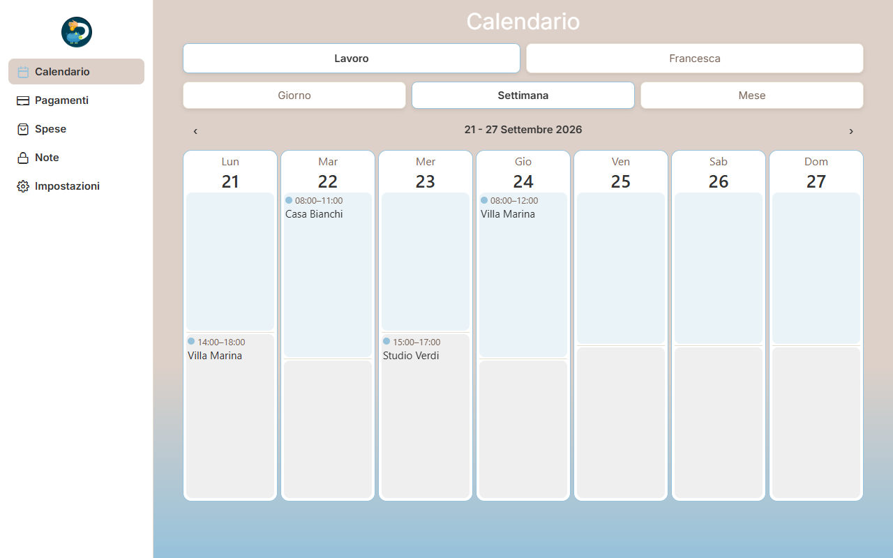
  
</p>

---

## Screenshot

Le schermate usano un account demo con dati inventati.

| Pagamenti: 4 metriche + saldo per cliente | Dettaglio cliente (modale a foglio) |
|---|---|
| 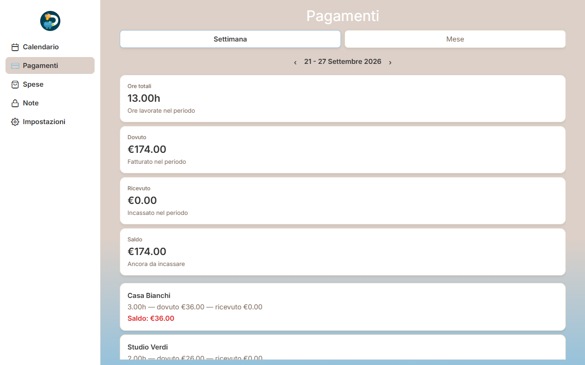 | 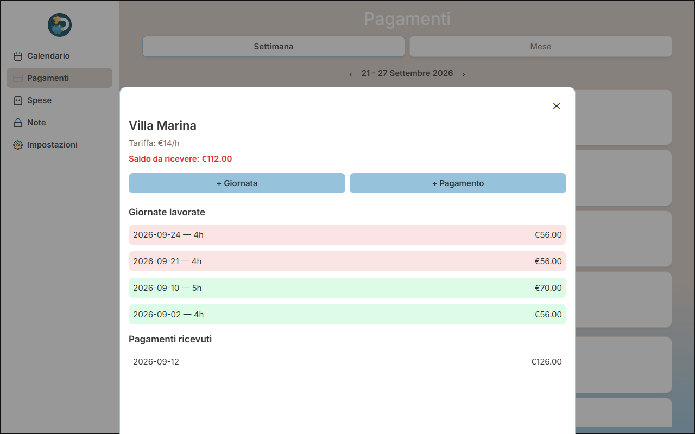 |
| **Calendario familiare: impegni ricorrenti, vista mese** | **Note: sezioni, la sezione Password è cifrata** |
| 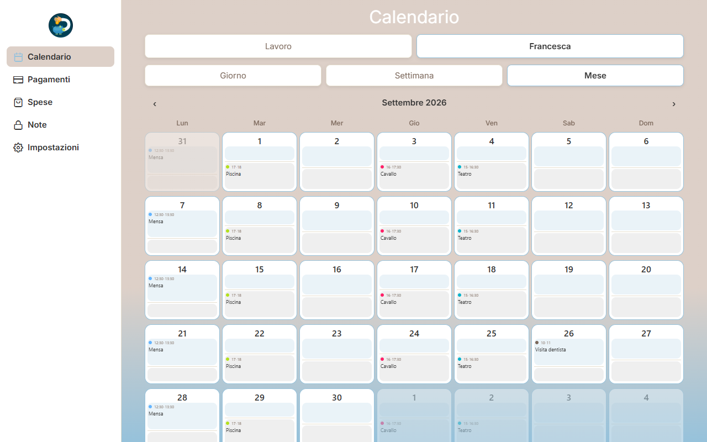 | 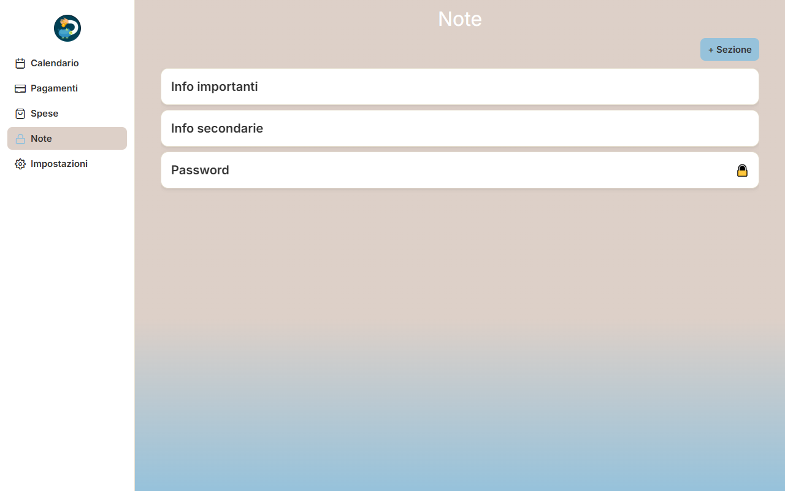 |

Su mobile la sidebar diventa una tab bar in basso e i dettagli si aprono come fogli che salgono dal basso:

<p align="center">
  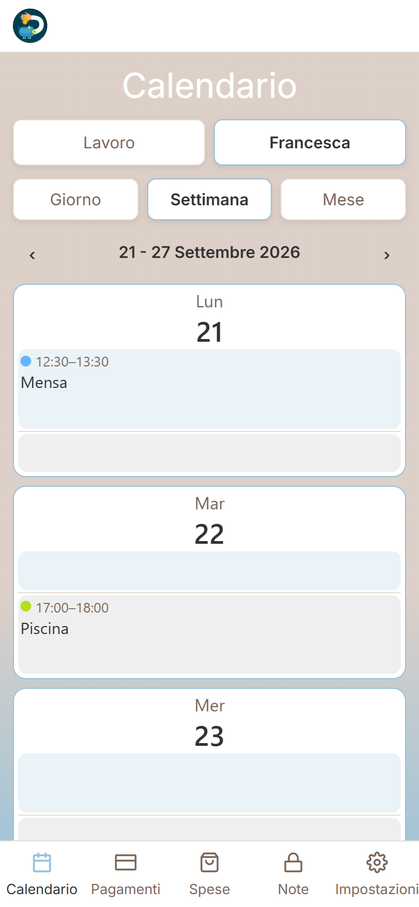
  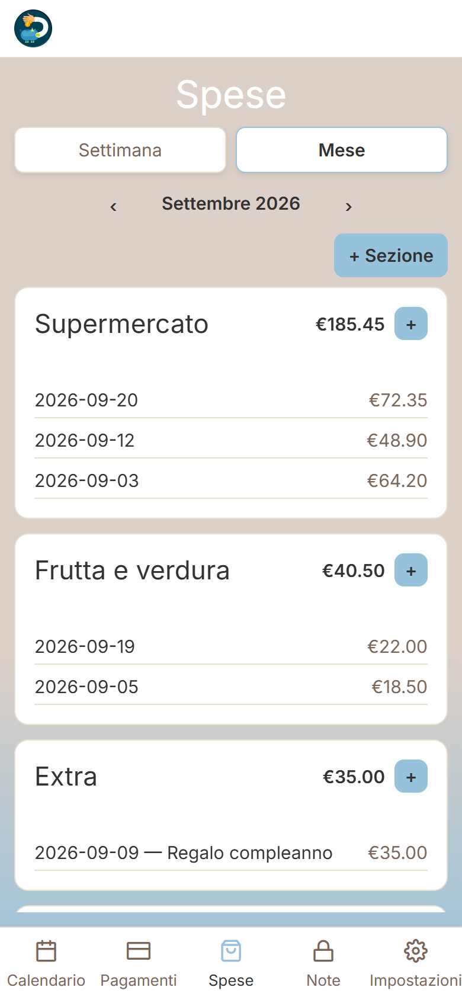
  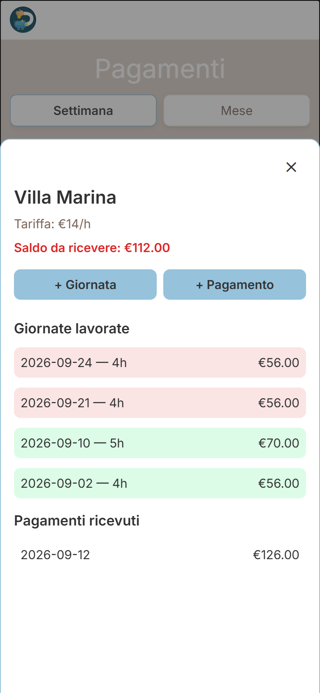
  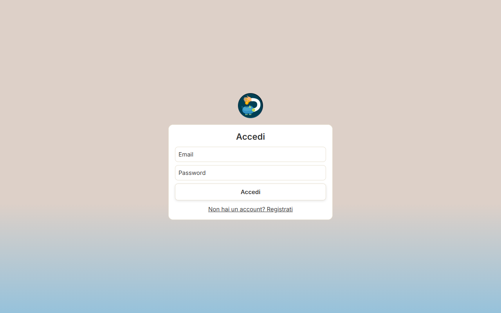
</p>

---

## Funzionalità

- **Calendario Lavoro / Francesca.** Viste giorno, settimana e mese su un unico componente parametrico. Gli impegni ricorrenti (per esempio "piscina ogni martedì") sono **occorrenze virtuali**: non vengono salvate riga per riga, si calcolano al volo e si possono modificare o saltare per un singolo giorno. C'è un promemoria locale la sera prima.
- **Clienti e pagamenti.** Ogni giornata lavorata registra la tariffa in vigore in quel momento. Il saldo usa un **ledger FIFO calcolato in SQL**: i pagamenti coprono prima le giornate più vecchie, senza mai associarli a mano.
- **Spese mensili.** Navigazione per settimana o per mese e categorie personalizzabili da ogni famiglia.
- **Note** con una sezione **Password cifrata end-to-end** (AES-256-GCM). La passphrase è condivisa in famiglia e si recupera via email senza che il server veda mai le note in chiaro in una sessione normale.
- **Multi-famiglia fin dal primo giorno.** Chi si registra crea un nucleo familiare o entra in uno esistente con un codice invito, e ogni dato è isolato a livello di database.
- **Layout responsivo:** sidebar su schermi larghi (≥ 820px), tab bar su mobile. La navigazione a modali ha tre varianti: centrata, foglio dal basso, pannello laterale.

---

## Architettura

### Visione d'insieme

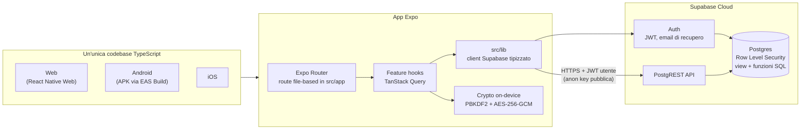

Il client non ha alcun privilegio speciale. Parla con Supabase usando la chiave pubblica (`anon`) e il JWT dell'utente, e ogni richiesta viene filtrata da **Row Level Security** direttamente in Postgres. Un bug nell'app non può quindi mostrare i dati di un'altra famiglia.

### Livelli del codice

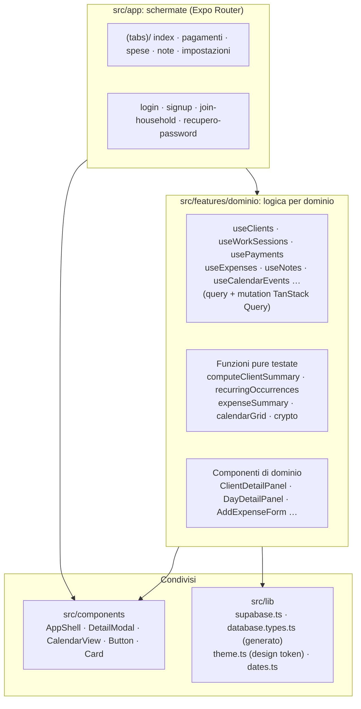

Regola del progetto: **i componenti non chiamano mai Supabase direttamente**, passano sempre da un hook del proprio dominio. La logica di calcolo (soldi, date, occorrenze ricorrenti) vive in file `.ts` puri, separati dai componenti, e ha test unitari.

### Modello dati

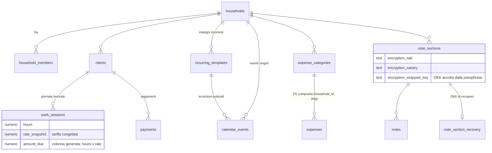

Ogni tabella ha `household_id` e la stessa policy `is_household_member(household_id)` per lettura e scrittura. Il saldo di ogni giornata ("pagata" o "da pagare") non è salvato in una colonna. Lo calcola la view `work_session_status` (`security_invoker = true`) con una window function: somma cumulativa del dovuto confrontata con il totale pagato.

### Cifratura della sezione Password

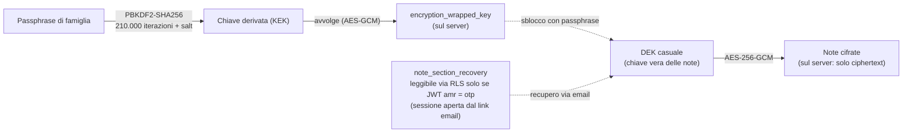

Le note sono cifrate con una chiave casuale (DEK). La passphrase non cifra le note, cifra solo quella chiave: è lo schema *envelope encryption*. Così la passphrase si può reimpostare dal link di recupero via email senza ricifrare nulla. Durante un login normale nessuno, nemmeno un altro membro della famiglia, può leggere la copia di recupero.

---

## Scelte tecniche principali

| Scelta | Perché |
|---|---|
| **Expo Router** invece di React Navigation manuale | Un solo albero di route (file-based, come Next.js) per web, Android e iOS. |
| **Supabase** invece di un backend custom | Postgres reale con RLS, Auth già pronta e tipi TypeScript generati dallo schema. La logica "server" che serve (funzioni atomiche, policy) è scritta in SQL. |
| **RLS** invece di filtri `WHERE` nell'app | La sicurezza vale anche se il codice client dimentica un filtro. |
| **TanStack Query** invece di Redux | Quasi tutto lo stato viene dal server: cache, invalidazione e loading/error senza `useEffect` scritti a mano. |
| **Saldo FIFO calcolato** invece di un flag "pagato" | Non esiste uno stato incoerente da correggere: il saldo è sempre una funzione dei dati grezzi. |
| **Occorrenze ricorrenti virtuali** | Nessun job che genera righe future: cambiare un impegno ricorrente vale subito per tutte le date. |
| **Nessuna UI library** | `StyleSheet` più un piccolo design system interno (`theme.ts`, 6 componenti condivisi): meno vincoli di compatibilità cross-platform. |

---

## Qualità e test

- **142 test unitari** (Jest, `jest-expo/node`) sulle funzioni pure: calcoli monetari, date, griglia calendario, occorrenze ricorrenti, codifica testo per la cifratura.
- **29 test di integrazione RLS** contro un database Supabase reale, senza mock. Creano utenti veri e verificano che un utente non possa leggere né modificare i dati di un altro nucleo familiare. Coprono anche la scrittura, perché in Postgres un `UPDATE` bloccato da RLS non dà errore, modifica zero righe.
- **15 migrazioni SQL** versionate in `supabase/migrations/`.
- TypeScript `strict`, con i tipi del database generati automaticamente (`src/lib/database.types.ts`).

```bash
npm test          # test unitari
npm run test:rls  # test RLS (richiede .env.test con le credenziali del progetto di test)
npx tsc --noEmit  # type check
```

---

## Avvio in locale

Requisiti: Node.js 20+ e un progetto Supabase.

```bash
npm install
# .env nella root:
#   EXPO_PUBLIC_SUPABASE_URL=...
#   EXPO_PUBLIC_SUPABASE_ANON_KEY=...
npx supabase db push   # applica le migrazioni
npx expo start         # poi "w" per il web, oppure un development build su telefono
```

Build Android installabile (cloud, EAS):

```bash
npx eas-cli build --platform android --profile preview
```

Le variabili `EXPO_PUBLIC_*` vengono inserite nel bundle al momento della build. Vanno quindi impostate anche su EAS per ogni ambiente (`eas env:set`): EAS non legge il file `.env` locale.

---

## Documentazione

- [`docs/LEARNING.md`](docs/LEARNING.md): scelte tecniche spiegate nel dettaglio, 24 bug reali trovati e come sono stati risolti, limiti noti.
- [`docs/superpowers/specs/`](docs/superpowers/specs/): specifiche di prodotto e design scritte prima del codice.
- [`docs/superpowers/plans/`](docs/superpowers/plans/): piani di implementazione per blocco.
