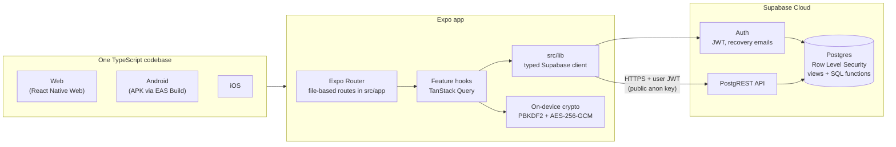
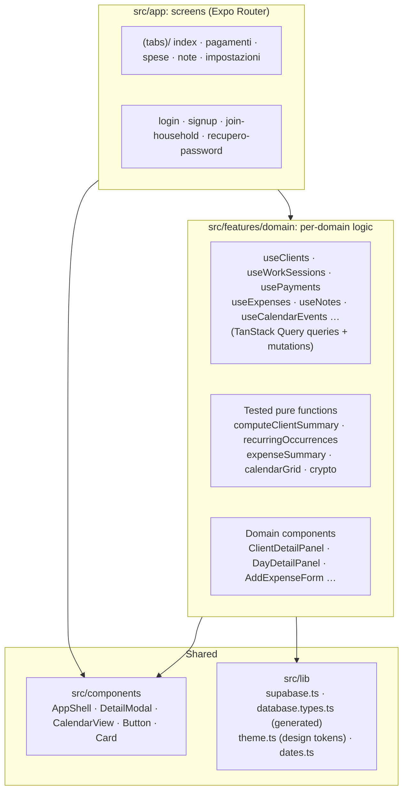
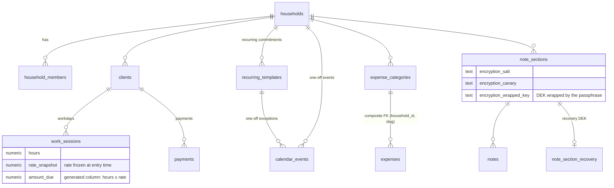
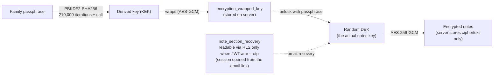

# Manager App

A family-management app used every day by a real family. It combines a **calendar**, **client and payment tracking** for a small cleaning business, **monthly expenses**, and **notes**, including a password section with end-to-end encryption. It is a single TypeScript codebase that runs as a **web app and on Android and iOS**.

**Stack:** React Native 0.86 · Expo SDK 57 (Expo Router) · TypeScript (strict) · Supabase (Postgres + Auth + Row Level Security) · TanStack Query · Jest · EAS Build

<p align="center">
  
  
</p>

---

## Screenshots

The app's interface is in Italian. The screenshots below were taken with a demo account filled with made-up data.

| Payments: 4 metrics and a balance per client | Client detail (bottom-sheet modal) |
|---|---|
|  |  |
| **Family calendar: recurring commitments, month view** | **Notes: sections, including the encrypted Password section** |
|  |  |

On mobile, the sidebar becomes a bottom tab bar and detail views open as sheets that slide up from the bottom:

<p align="center">
  
  
  
  
</p>

---

## Features

- **Work and family calendars.** Day, week, and month views are all built on one parameterized component.
  - Recurring commitments (for example "swimming every Tuesday") are **virtual occurrences**: the app computes them on the fly instead of storing one row per date.
  - A single occurrence can be edited or skipped for that day only.
  - A local reminder fires the evening before.
- **Clients and payments.** Each logged workday records the hourly rate in effect that day. Balances come from a **FIFO ledger computed in SQL**: payments cover the oldest workdays first, so they never have to be matched to specific days by hand.
- **Monthly expenses.** You can browse by week or by month, and each family can define its own categories.
- **Notes**, including a **Password section with end-to-end encryption** (AES-256-GCM).
  - The family shares one passphrase.
  - A forgotten passphrase can be recovered by email.
  - During a normal session, the server never sees the notes in plaintext.
- **Multi-family from day one.** A new user either creates a household or joins an existing one with an invite code. The database keeps each household's data isolated from every other household.
- **Responsive layout.** Wide screens (≥ 820px) get a sidebar and phones get a tab bar. Modals come in three variants: a centered card, a bottom sheet, and a side panel.

---

## Architecture

### Overview



The client has no special privileges. It calls Supabase with the public `anon` key and the user's JWT, and **Row Level Security** in Postgres filters every request. A bug in the app therefore cannot expose another family's data.

### Code layers



Project rule: **components never call Supabase directly**. They always go through a hook for their domain. Calculation logic (money, dates, recurring occurrences) lives in plain `.ts` files kept separate from components, and is unit-tested.

### Data model



Every table has a `household_id` column and uses the same `is_household_member(household_id)` policy for reads and writes. Whether a workday is paid is not stored in a column. The `work_session_status` view (`security_invoker = true`) computes it with a window function: it compares the running total owed against the total paid.

### Password section encryption



The notes are encrypted with a random key (the DEK). The passphrase does not encrypt the notes; it only encrypts that key. This is *envelope encryption*. As a result, the passphrase can be reset from the email recovery link without re-encrypting anything. During a normal login, nobody can read the recovery copy of the key, not even another family member.

---

## Key technical decisions

| Decision | Why |
|---|---|
| **Expo Router** instead of hand-wired React Navigation | One file-based route tree (like Next.js) serves web, Android, and iOS. |
| **Supabase** instead of a custom backend | A real Postgres database with RLS, built-in Auth, and TypeScript types generated from the schema. The server-side logic the app needs (atomic functions, access policies) is written in SQL. |
| **RLS** instead of `WHERE` filters in app code | Data stays secure even if client code forgets a filter. |
| **TanStack Query** instead of Redux | Almost all state comes from the server. TanStack Query handles caching, invalidation, and loading/error states, with no hand-written `useEffect` fetching. |
| **Computed FIFO balance** instead of a stored "paid" flag | There is no stale state to repair: the balance is always derived from the raw data. |
| **Virtual recurring occurrences** | No job has to generate future rows. Changing a recurring commitment applies to every date immediately. |
| **No UI library** | Plain `StyleSheet` plus a small in-house design system (`theme.ts` and 6 shared components). This means fewer cross-platform compatibility constraints. |

---

## Quality and tests

- **142 unit tests** (Jest, `jest-expo/node`) cover the pure functions: money calculations, dates, the calendar grid, recurring occurrences, and text encoding for encryption.
- **29 RLS integration tests** run against a real Supabase database, with no mocks. They create real users and check that one user cannot read or modify another household's data. They also cover writes, because in Postgres an `UPDATE` blocked by RLS does not raise an error; it simply changes zero rows.
- **15 versioned SQL migrations** live in `supabase/migrations/`.
- TypeScript runs in `strict` mode, with database types generated automatically (`src/lib/database.types.ts`).

```bash
npm test          # unit tests
npm run test:rls  # RLS tests (needs a .env.test with test project credentials)
npx tsc --noEmit  # type check
```

---

## Running locally

Requirements: Node.js 20+ and a Supabase project.

```bash
npm install
# .env in the project root:
#   EXPO_PUBLIC_SUPABASE_URL=...
#   EXPO_PUBLIC_SUPABASE_ANON_KEY=...
npx supabase db push   # apply the migrations
npx expo start         # then press "w" for web, or use a development build on a phone
```

To build an installable Android app (in the cloud, with EAS):

```bash
npx eas-cli build --platform android --profile preview
```

`EXPO_PUBLIC_*` variables are inlined into the bundle at build time. They must also be set on EAS for each environment (`eas env:set`), because EAS does not read the local `.env` file.

---

## Documentation (in Italian)

- [`docs/LEARNING.md`](docs/LEARNING.md): technical decisions in detail, the 24 real bugs found during development and how each was fixed, and known limitations.
- [`docs/superpowers/specs/`](docs/superpowers/specs/): product and design specs, written before any code.
- [`docs/superpowers/plans/`](docs/superpowers/plans/): implementation plans for each block.
